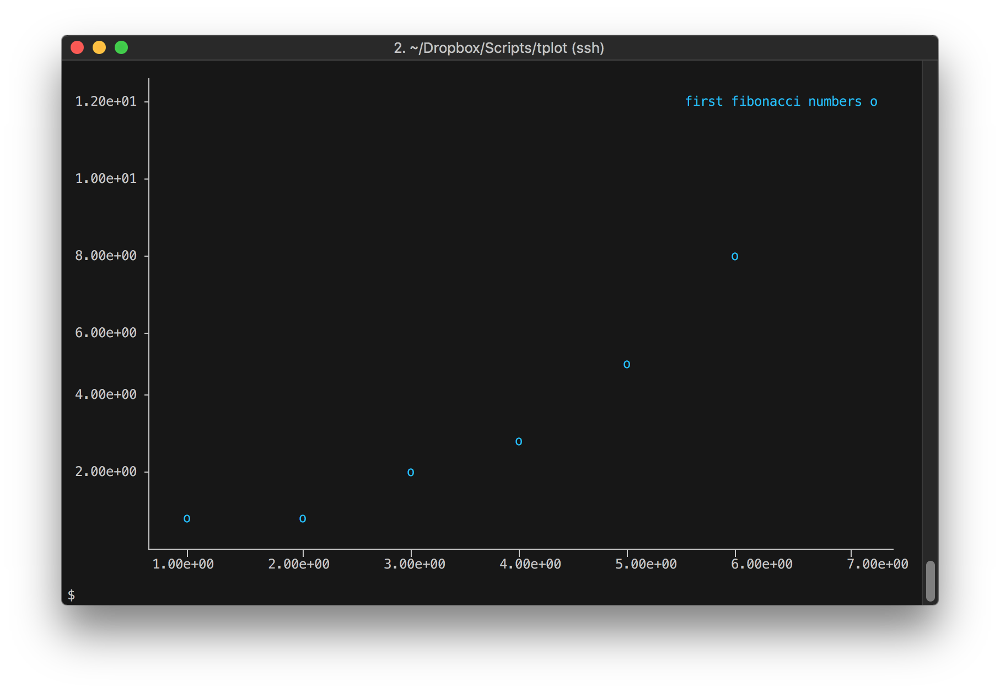

# **TPlot**

A Python package for creating and displaying matplotlib plots in the console/terminal.

## Index

1. [Installation](#installation)
   - [Requirements](#requirements)
   - [Installation from source](#installation-from-source)
   - [Configuration](#configuration)
2. [Help](#help)
3. [Examples](#examples)
   - [Simple series plot](#simple-series-plot)
   - [Simple scatter plot](#simple-scatter-plot)
   - [Multiple scatter plots](#multiple-scatter-plots)
   - [Pipes as data source](#pipes-as-data-source)
   - [STDIN as data source](#stdin-as-data-source)
   - [Histograms](#histograms)
   - [Series plot with log-scale on the y-axis](#series-plot-with-log-scale-on-the-y-axis)
   - [Supress colored output](#supress-colored-output)
   - [Lines and Grid](#lines-and-grid)
   - [Output as a Matplotlib plot](#output-as-a-Matplotlib-plot)

## Installation

### Requirements

- Matplotlib > 2
- Numpy > 1.15

### Installation from source

1. clone repository

```console
$ git clone https://github.com/sergiomsantos/tplot.git
```

2. install package

```console
$ python setup.py install
```

3. test installation (as an executable on the user's `PATH`)

```console
$ tploh -h
usage: tplot [-h] [--version] [-f FILE] [-c C L? [C L? ...]]
  [...]
```

4. or as a `python` module
  
```console
$ python -m tplot
usage: tplot [-h] [--version] [-f FILE] [-c C L? [C L? ...]]
  [...]
```

### Configuration

**TPlot** is configurable through the use of the following environment variables, which can be
defined in the shell configuration file (typically `.bashrc` or similar) to be used as default settings:

- `TPLOT_NOGUI` - disables Matplotlib's windowed backend.
When defined, the `--mpl`
option will not produce any result (useful if working over an SSH connection without
starting the X11 client). 
- `TPLOT_SIZE` - default output size (ex. èxport)
- `TPLOT_GRID` - ANSI escape code for coloring the grid (default is `'\033[2m'`)
- `TPLOT_COLOR[1-6]` - ANSI escape code for coloring individual curves (default is `'\033[31m'`, ..., `'\033[36m'`)


The following snippet can be used to configure **TPlot** in a BASH environment:

```BASH
export TPLOT_NOGUI=1            # disable Matplotlib output
export TPLOT_SIZE='80,30'       # 80 columns x 30 lines
export TPLOT_GRID='\033[2m'     # dark gray
export TPLOT_COLOR1='\033[31m'  # red
export TPLOT_COLOR2='\033[31m'  # green
export TPLOT_COLOR3='\033[31m'  # yellow
export TPLOT_COLOR4='\033[31m'  # blue
export TPLOT_COLOR5='\033[31m'  # magenta
export TPLOT_COLOR6='\033[31m'  # cyan
```

## Help

Help is available through the `-h` or `--help` flags:

```console
$ tplot -h
usage: tplot [-h] [--version] [-f FILE] [-c C L? [C L? ...]]
             [-xy X Y L? [X Y L? ...]] [--hist H L? [H L? ...]] [--bins N]
             [--lines] [-d D] [-s N] [--comment [S [S ...]]] [-ax xmin xmax]
             [-ay ymin ymax] [--logx] [--logy] [--grid] [--width W]
             [--height H] [--padding P] [--mpl] [--no-color]

A Python package for creating and displaying matplotlib plots in the
console/terminal

optional arguments:
  -h, --help            show this help message and exit
  --version             show program's version number and exit
  -f FILE, --file FILE  source file. Use "-" to read from stdin

Plot arguments:
  -c C L? [C L? ...]    series plot of column(s) C with optional label L
  -xy X Y L? [X Y L? ...]
                        scatter plot of column X vs Y with optional label L
  --hist H L? [H L? ...]
                        histogram of column(s) H with optional label L
  --bins N              number of bins
  --lines               requires that the x-coordinate sequence is increasing
                        if the -xy option is specified

Data parsing:
  -d D, --delimiter D   delimiter
  -s N, --skip N        skip first N rows
  --comment [S [S ...]]
                        Characters used to indicate the start of a comment

Axis configuration:
  -ax xmin xmax         x-axis limits
  -ay ymin ymax         y-axis limits
  --logx                set log-scale on the x-axis
  --logy                set log-scale on the y-axis
  --grid                show grid

Output configuration:
  --width W             output width
  --height H            output height
  --padding P           left padding
  --mpl                 show plot in matplotlib window
  --no-color            suppress colored output
```

## Examples

### Simple series plot

Request a series plot (`-c`) of column 3:

```console
$ tplot -f resources/data.txt -c 3
```


### Simple scatter plot

Request a scatter plot (`-xy`) of columns 1 vs 0 of file `data.txt`:

```console
$ tplot -f resources/data.txt -xy 0 1
```


### Multiple scatter plots

Request multiple scatter plots (`-xy`) of columns 1 vs 0 and 2 vs 0,
with the second set labelled as `5*cos(x)`:

```console
$ tplot -f resources/data.txt -xy 0 1 -xy 0 2 '5*cos(x)'
```


### Pipes as data source

Feed data into `tplot` directly using a pipe:

```console
$ seq 1 100 | tplot -c 0 'simple sequence'
```


### STDIN as data source

Feed data into `tplot` directly using a pipe:

```console
$ tplot -f - -xy 0 1 'first fibonacci numbers'
1
1
2
3
4
8
^D
```



### Histograms

Request an histogram (`--hist`) of column 1 and specify the
number of bins (`--bins`) and data range (`-ax`):

```console
$ tplot -f resources/data.txt --hist 1 'an histogram' --bins=5 -ax -5 5
```


### Series plot with log-scale on the y-axis

Request a series plot (`-c`) of column 3 ith a log-scaled y-axis (`--logy`):

```console
$ tplot -f resources/data.txt -c 3 --logy
```


### Lines and Grid

Points connected by lines (`--lines`) and grid (`--grid`), with data taken
from a comma delimited (`-d/--delimiter`), commented (`--comment`) file: 

```console
$ cat resources/fib.txt
# this is a comment
@ this is another
1,1
2,1
[...]
10,52

$ tplot -f resources/fib.txt --delimiter , --comment '#' '@' --grid -c 1 'column 2' --lines
```


### Supress colored output

Supress colored output (`--no-color`):

```console
$ tplot -f resources/data.txt -c 2 --no-color
```


### Output as a Matplotlib plot

```console
$ tplot -f resources/data.txt -xy 0 1 --mpl
```


