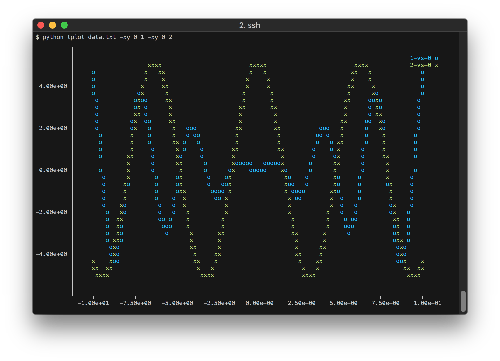

# TPlot

A Python package for creating and displaying matplotlib plots in the console/terminal.

## Installation

```bash
# clone repository
$ git clone https://github.com/sergiomsantos/tplot.git

# install package
$ python setup.py install
```


# Usage

### Help

Help is available through the `-h` or `--help` flags:

```bash
$ tplot -h
usage: tplot [-h] [-xy X [Y ...]] [-c [C [C ...]]] [--hist [H [H ...]]]
             [--bins N] [-d D] [-s N] [-ax xmin [xmax ...]]
             [-ay ymin [ymax ...]] [--logx] [--logy] [--width W] [--height H]
             [--mpl] [--no-color]
             [file]

positional arguments:
  file

optional arguments:
  -h, --help           show this help message and exit

Plot arguments:
  -xy X [Y ...]        scatter plot of column X vs Y
  -c [C [C ...]]       series plot of column(s) C
  --hist [H [H ...]]   histogram of column(s) H
  --bins N             number of bins

Data parsing:
  -d D, --delimiter D  delimiter
  -s N, --skip N       skip first N rows

Axis configuration:
  -ax xmin [xmax ...]  x-axis limits
  -ay ymin [ymax ...]  y-axis limits
  --logx               set log-scale on the x-axis
  --logy               set log-scale on the y-axis

Output configuration:
  --width W            output width
  --height H           output height
  --mpl                show plot(s) in matplotlib window
  --no-color           suppress coloured output
```

### Simple scatter plot

Request a scatter plot (`-xy`) of columns 1 vs 0 of file `data.txt`:


### Multiple scatter plots

Request multiple scatter plots (`-xy`) of columns 1 vs 0 and 2 vs 0:



### Pipes as data source

Feed data into `tplot` directly using a pipe:


### Histogram

Request an histogram (`--hist`) of column 1 and specify the
number of bins (`--bins`) and data range (`-ax`):


